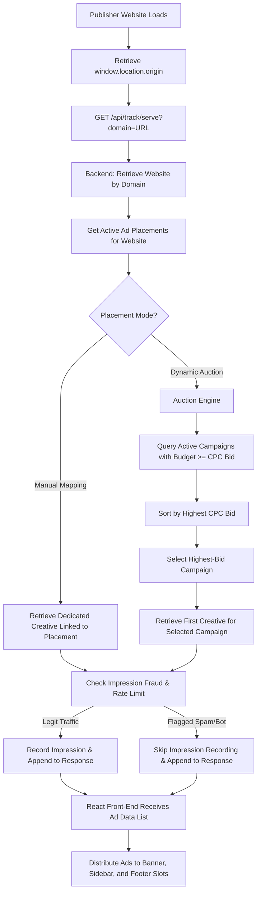
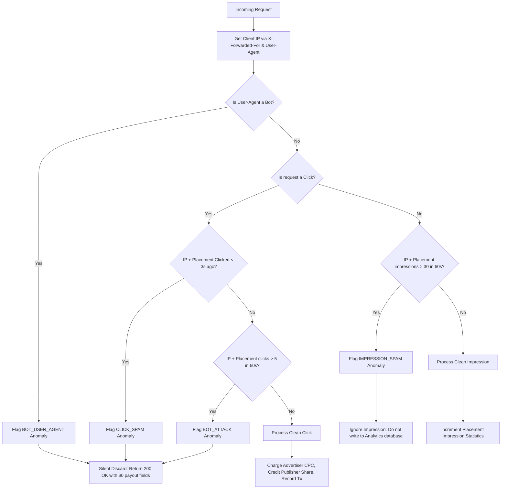

# AdSphere Architecture & Technical Flow Reference Manual

Welcome to the comprehensive technical documentation for the **AdSphere Ad Network**. This manual explains the end-to-end flows, dynamic matching algorithms, real-time fraud detection pipeline, and role-based functionalities of the application.

---

## 🗺️ System Architecture Overview

AdSphere consists of three main components:
1. **Spring Boot Backend**: Serves REST APIs, manages database entities, runs the auction matching engine, and executes real-time fraud rate-limiting checks.
2. **Angular Admin/Advertiser Portal**: Premium dashboard built with Angular 17, providing analytics charts, platform admin panels, and user management.
3. **React Publisher Integration**: Integrates directly into publisher websites to dynamically request and display ads without hardcoding unique website identifiers.

---

## 🛠️ End-to-End Ad Delivery & Placement Flow

AdSphere uses a optimized single-request bulk serving mechanism to load all ad slots on a publisher page in one refresh, resolving individual ad creatives using either manual mapping or our dynamic auction matching engine.

### 1. Dynamic Matching & Serving Flow Diagram

### 2. The Dynamic Auction Algorithm
When a publisher placement is configured for **Dynamic Matching**, the backend runs a real-time highest-bid auction:
1. **Filtering**: It queries all campaigns from the database that are currently `ACTIVE`.
2. **Budget Verification**: It filters out campaigns whose remaining budget is less than their Cost-Per-Click (`cpcBid`) value.
3. **Auction Selection**: It compares the `cpcBid` of all eligible funded campaigns, selecting the campaign with the highest bid (` fundedCampaigns.stream().max(Comparator.comparing(Campaign::getCpcBid)) `).
4. **Fallback**: If no funded campaigns are available, the publisher's placement displays a high-resolution Unsplash fallback banner.

---

## 🛡️ Fraud Detection & Anomaly Pipeline

AdSphere features a multi-tiered real-time and post-hoc fraud detection pipeline to protect advertiser budgets and maintain platform trust.

### 1. Real-Time Security Layers
All requests hitting the tracking controller (`/serve`, `/impression`, and `/click`) pass through the `FraudDetectionService` to filter malicious traffic:

### 2. Silent Discarding Mechanism
To prevent bot operators or click-fraud scripts from realizing they have been detected, AdSphere uses a **Silent Discard** strategy for flagged clicks:
* The HTTP response status remains `200 OK`.
* The transaction amount fields are returned as `0.0000` (`totalAmount: 0`).
* No campaign budget is deducted, no revenue shares are generated, and no database write occurs.

### 3. Historical Anomaly Scanning
In addition to real-time blocks, `AdminService` scans historical daily aggregation tables to flag:
* **Suspicious CTR (`FRAUD_CTR`)**: Flagged when a placement receives more than 50 impressions and achieves a Click-Through Rate (CTR) exceeding **25%** (highly indicative of click-fraud groups or manual publisher clicking).
* **Dead Inventory (`DEAD_INVENTORY`)**: Flagged when a placement receives more than 1000 impressions but **0 clicks**, indicating that the placement code is broken or hidden from human users.

---

## 👥 Role-Based Functionalities & User Flows

AdSphere tailoring provides dedicated flows for four roles in the advertising lifecycle:

### 1. The Advertiser
* **Campaign Builder**: Creates campaigns by defining title, total budget, CPC bids, and uploading creative banners.
* **Creatives Management**: Uploads ad assets (destination link, headline, descriptions, image URL).
* **Analytics Insights**: Tailored dashboard displaying real-time Spend, Clicks, Impressions, CTR chart trends, and budget tracking.
* **Campaign Lifecycle**: Campaigns enter a pending moderation state, start running upon admin approval, and automatically transition to completed when the budget is spent.

### 2. The Publisher
* **Website Registration**: Registers domain URLs where ads will be served.
* **Placement Creator**: Allocates slots (Banners, Sidebars, Footers) and chooses between linking a manual campaign or opting into the dynamic auction pool.
* **Real-time Earnings**: Tails impressions, clicks, CTR, and collects a **70% revenue share** on all legitimate clicks.

### 3. The Network Admin
* **Moderation Queue**: Reviews pending campaigns and websites, verifying safety compliance before approving or rejecting.
* **Operations Oversight**: Quick actions to verify active sites and creatives across the network.

### 4. The Super Admin (Platform Owner)
* **Macro Financial Dashboard**: Observes total system throughput, platform revenue share (**10% platform fee**), and network revenue share (**20% network fee**).
* **System Health Console**: Monitors the real-time anomalies feed displaying blocked bots, click spam, and budget exhaustion alerts.
* **Instant Suspension**: Features a single-click suspension button to deactivate fraudulent publishers or websites directly from the anomalies alert.

---

## 📊 Database Modeling & Revenue Splitting

Every legitimate click transaction results in a records update that distributes the cost-per-click bid:
* **Publisher Earnings (70%)**: Added to publisher's balance.
* **Network Operations (20%)**: Retained by the platform.
* **Platform Operations (10%)**: Retained as platform fee.

### Database Entities
* **`User`**: Tracks roles, statuses (`ACTIVE`, `SUSPENDED`), and balances.
* **`Website`**: Maps registered domains to publishers and status.
* **`AdPlacement`**: Represents ad real estate slots on websites.
* **`Campaign`**: Details advertiser CPC bid, remaining budget, and status.
* **`RevenueTransaction`**: Stores exact timestamp logs of financial distribution for auditing.
* **`Analytics`**: Aggregates daily impression and click records per placement/campaign combination.
